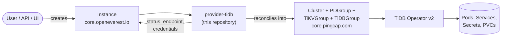

# TiDB Provider

> [!WARNING]
> **Pre-alpha.** OpenEverest v2 and this provider are under active development. CRD schemas,
> chart values and defaults change frequently, including in breaking ways, and there is no
> supported upgrade path between versions yet. Not for production use.

[](https://github.com/openeverest/openeverest)
[](https://github.com/openeverest/provider-tidb/actions/workflows/ci.yaml)
[](https://github.com/openeverest/provider-tidb/releases)
[](https://pkg.go.dev/github.com/openeverest/provider-tidb)
[](LICENSE)

Run [**TiDB**](https://github.com/pingcap/tidb) — a distributed, MySQL-compatible SQL database —
on Kubernetes through [OpenEverest](https://github.com/openeverest/openeverest), backed by
[**TiDB Operator v2**](https://github.com/pingcap/tidb-operator).

## What this is

OpenEverest providers translate a single, technology-agnostic `Instance` custom resource into
the native custom resources of an upstream Kubernetes operator. This repository is the provider
for TiDB: it owns the technology-specific knowledge — components, topologies, versions and
parameters — so that users, the API server, and the UI stay technology-agnostic.

A TiDB cluster is composed of three mandatory components, each reconciled into its own
TiDB Operator v2 resource:

| Component | Role | Operator resource |
|---|---|---|
| `pd` | Placement Driver — metadata, timestamps (TSO), scheduling | `PDGroup` |
| `tikv` | Distributed key-value storage engine | `TiKVGroup` |
| `tidb` | Stateless SQL layer (MySQL protocol) | `TiDBGroup` |

> [!IMPORTANT]
> **This provider is not standalone.** It requires an OpenEverest installation (core CRDs and
> controller) in the cluster. Installing this chart on its own does nothing.
> See [Install OpenEverest](https://openeverest.io/documentation/current/quick-install.html).



The provider watches `Instance` resources whose `spec.providerRef.name` is `tidb`, generates a
shared `Cluster` plus one component group per component, and reports cluster health and the MySQL
connection endpoint back onto `Instance.status`. It never manages pods directly — all lifecycle
work is delegated to the operator.

## Compatibility

| provider-tidb | OpenEverest | TiDB Operator | Kubernetes |
|---|---|---|---|
| `0.1.x` | `>= 2.0.0` | `v2.0.1` | `1.30` – `1.36` |

The bundled operator manages TiDB engine versions independently (see [Versions](#versions)).

## Capabilities

What you can do to a running instance through the `Instance` API. Upgrading the provider itself
is covered under [Installation](#installation).

| Capability | Status | Notes |
|---|---|---|
| Provisioning | ✅ | PD + TiKV + TiDB |
| Horizontal scaling | ✅ | Per-component `replicas` |
| Vertical scaling (CPU / memory) | ✅ | Per-component `resources` |
| Custom configuration | ✅ | Inline TOML `config` per component |
| Version upgrades | ❌ | Planned — ordered rolling upgrade |
| Monitoring | ❌ | Planned |
| TLS | ❌ | Planned |

Stateful components (PD, TiKV) additionally report:

| Capability | Status | Notes |
|---|---|---|
| Persistent storage | ✅ | Per-component size and storage class |
| Storage expansion | ❌ | Planned |
| Backups (on demand) | ❌ | Planned — `br.pingcap.com` |
| Backups (scheduled) | ❌ | Planned |
| Point-in-time recovery | ❌ | Planned |
| Restore | ❌ | Planned |

See [ROADMAP.md](ROADMAP.md) for the planned work.

## Installation

The provider chart is published as an OCI artifact:

```bash
helm install provider-tidb \
  oci://ghcr.io/openeverest/charts/provider-tidb \
  --version <chart-version> \
  --namespace everest-system
```

The chart is self-contained:

- **TiDB Operator v2 is bundled** as a chart dependency and installed automatically. Disable it
  with `--set operator.enabled=false` to run against an externally managed operator.
- **The TiDB CRDs are shipped in the chart** (`charts/provider-tidb/crds/`) and installed before
  the operator, which requires them to be present at startup.

Upgrade and uninstall:

```bash
helm upgrade provider-tidb oci://ghcr.io/openeverest/charts/provider-tidb
helm uninstall provider-tidb --namespace everest-system
```

Uninstalling the chart does **not** delete running `Instance` resources, the TiDB CRDs, or any
data.

## Usage

Verify that the provider registered itself:

```bash
kubectl get providers.core.openeverest.io tidb
```

Create an instance:

```yaml
apiVersion: core.openeverest.io/v1alpha1
kind: Instance
metadata:
  name: my-tidb
spec:
  providerRef:
    name: tidb
  version: "8.5.2"
  topology:
    type: cluster
  components:
    pd:
      type: pd
      replicas: 3
      storage:
        size: 20Gi
    tikv:
      type: tikv
      replicas: 3
      storage:
        size: 50Gi
    tidb:
      type: tidb
      replicas: 2
```

`spec.version` and `spec.topology` are optional; the provider defaults apply (PD 3, TiKV 3,
TiDB 2, default version bundle). More examples live in [examples/](examples/).

Watch it come up and read the connection details:

```bash
kubectl get instances.core.openeverest.io my-tidb -w
kubectl get instances.core.openeverest.io my-tidb -o jsonpath='{.status.connectionSecretRef.name}'
```

The connection secret holds the MySQL `host`, `port` (4000), `username` (`root`) and `password`.
The provider generates a random `root` password on first bootstrap (via the operator's
`bootstrapSQL`), stores it in a Secret, and surfaces it here. Connect with any MySQL client:

```bash
mysql -h my-tidb-tidb.<namespace> -P 4000 -u root -p"$(kubectl get secret my-tidb-conn -o jsonpath='{.data.password}' | base64 -d)"
```

> [!NOTE]
> Each component group expands into one instance resource per replica — e.g. `spec.components.tidb.replicas: 2`
> yields two `TiDB` resources (`kubectl get tidb`) and two pods, all belonging to one `TiDBGroup`
> (`kubectl get tidbgroup`). This mirrors how a Deployment owns its Pods.

## Topologies

| Topology | Default | Description |
|---|---|---|
| `cluster` | ✅ | Standard distributed TiDB: PD + TiKV + TiDB |

## Versions

| Version bundle | Default | Components |
|---|---|---|
| `8.5.2` | ✅ | PD / TiKV / TiDB `v8.5.2` |
| `7.5.5` |  | PD / TiKV / TiDB `v7.5.5` |

Source of truth: [definition/versions.yaml](definition/versions.yaml). Each bundle pins PD, TiKV
and TiDB to the same TiDB release; the user selects one via `Instance.spec.version`.

## Configuration

- **Chart values:** [charts/provider-tidb/values.yaml](charts/provider-tidb/values.yaml) — provider
  deployment settings and the bundled `operator` subchart values.
- **Instance parameters:** per-component `config` (inline TOML) and per-topology parameters,
  defined under [definition/](definition/) and published on the `Provider` resource
  (`kubectl get provider tidb -o yaml`). The API server and the UI validate user input against
  these schemas.

## Development

Requires Go (see [go.mod](go.mod)), Docker, Helm, kubectl, and a Kubernetes cluster you can
reach. [dev/README.md](dev/README.md) covers the environment end to end: the recommended
local k3d setup, running against a cluster you already have, and every `dev/.env` setting.

```bash
make dev-up             # local cluster + Tilt dev environment (see dev/README.md)
make generate           # RBAC, provider spec, Helm chart sync
make run                # run the provider locally against the cluster
make test-unit
make test-integration   # chainsaw suites under test/integration/
make dev-down
```

`make help` lists every target. `make verify` fails when generated files are stale — run
`make generate` and commit the result.

The provider contract (`Validate` / `Sync` / `Status` / `Cleanup`), RBAC markers, watches,
code generation, and the backup/restore interfaces are documented once for all providers in
[PROVIDER_DEVELOPMENT.md](https://github.com/openeverest/provider-sdk/blob/main/PROVIDER_DEVELOPMENT.md).

### Layout

| Path | Purpose |
|---|---|
| `cmd/provider/` | Entry point |
| `internal/provider/` | `ProviderInterface` implementation (Sync/Validate/Status/Cleanup), RBAC markers |
| `internal/common/` | Component name constants |
| `definition/` | Provider identity, component types, versions, topologies |
| `charts/provider-tidb/` | Helm chart — bundles the operator subchart and TiDB `crds/`; `generated/` is produced by `make generate` |
| `config/rbac/role.yaml` | Generated `ClusterRole` — do not edit |
| `test/integration/` | Chainsaw suites (see its `README.md`) |
| `test/vars.sh` | Pinned operator and engine versions used by tests |
| `examples/` | Example `Instance` resources |
| `dev/` | Tilt dev environment, `.env` configuration, k3d cluster config |
| `.github/workflows/` | CI: lint, build, unit and integration tests, release |

### Testing

- **Unit tests** — `make test-unit` (mapping helpers + the provider-runtime conformance suite,
  which asserts every UI-schema field is reconciled by `Sync`).
- **Integration tests** — chainsaw suites under `test/integration/`. The `core/` suite exercises
  the full lifecycle: create an `Instance`, assert the provider produces the `Cluster` and
  component groups, simulate operator readiness, assert the `Instance` reports `Ready`, and delete.
  The operator itself is disabled for these tests (readiness is simulated). See
  [test/integration/README.md](test/integration/README.md).
- **CI** — `.github/workflows/ci.yaml` runs lint, build, unit tests, generated-file
  verification, Helm lint, and each integration suite on every pull request.

## Troubleshooting

```bash
kubectl logs -n everest-system deploy/provider-tidb -f
```

| Symptom | Where to look |
|---|---|
| `Instance` stuck in `Provisioning` | `kubectl describe instances.core.openeverest.io <name>` conditions, then the provider logs |
| No `Provider` resource in the cluster | Is the chart installed? Check the provider deployment logs |
| `Instance` ignored entirely | `spec.providerRef.name` must be `tidb` |
| Provider logs `no matches for kind "TiKVGroup"` | TiDB CRDs missing. Fresh chart installs ship them under `crds/`; if you upgraded an older release, apply them: `kubectl apply --server-side -f charts/provider-tidb/crds/` |
| Operator pod `CrashLoopBackOff` at startup | The TiDB CRDs must exist before the operator starts (see the row above) |
| Groups created but no pods | Inspect the group/instance status (`kubectl get tidbgroup,tikvgroup,pdgroup`) — the failure is upstream in the operator |

## Contributing

Issues and pull requests are welcome. See
[PROVIDER_DEVELOPMENT.md](https://github.com/openeverest/provider-sdk/blob/main/PROVIDER_DEVELOPMENT.md)
and the [OpenEverest Code of Conduct](https://github.com/openeverest/openeverest/blob/main/CODE_OF_CONDUCT.md).

## Security

Report vulnerabilities per the
[OpenEverest security policy](https://github.com/openeverest/openeverest/blob/main/SECURITY.md).
Please do not open public issues for security reports.

## License

Apache License 2.0 — see [LICENSE](LICENSE) for details.
